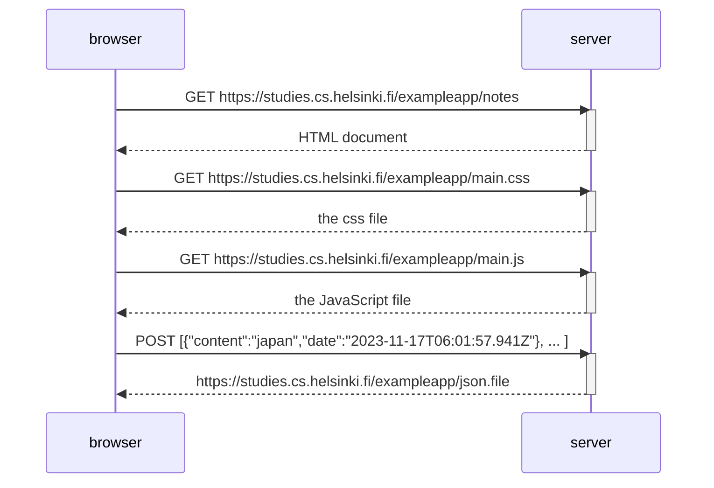
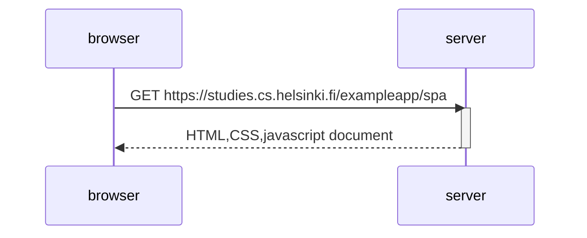
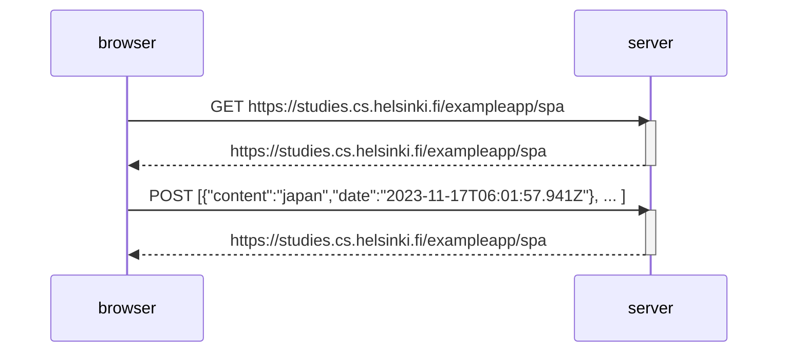

Here is a diagram 0.4:

```mermaid
sequenceDiagram
    participant browser
    participant server

    browser->>server: GET https://studies.cs.helsinki.fi/exampleapp/notes
    activate server
    server-->>browser: HTML document
    deactivate server

    browser->>server: GET https://studies.cs.helsinki.fi/exampleapp/main.css
    activate server
    server-->>browser: the css file
    deactivate server

    browser->>server: GET https://studies.cs.helsinki.fi/exampleapp/main.js
    activate server
    server-->>browser: the JavaScript file
    deactivate server

    browser->>server: POST [{"content":"japan","date":"2023-11-17T06:01:57.941Z"}, ... ]
    
    activate server
    server-->>browser: https://studies.cs.helsinki.fi/exampleapp/json.file
    deactivate server
    

```
Here is a diagram 0.5:

```mermaid
sequenceDiagram
    participant browser
    participant server

    browser->>server: GET https://studies.cs.helsinki.fi/exampleapp/spa
    activate server
    server-->>browser: HTML,CSS,javascript document
    deactivate server
```
Here is a diagram 0.6:

```mermaid
sequenceDiagram
    participant browser
    participant server

    browser->>server: GET https://studies.cs.helsinki.fi/exampleapp/spa
    activate server
    server-->>browser: https://studies.cs.helsinki.fi/exampleapp/spa
    deactivate server

    browser->>server: POST [{"content":"japan","date":"2023-11-17T06:01:57.941Z"}, ... ]
    
    activate server
    server-->>browser: https://studies.cs.helsinki.fi/exampleapp/spa
    deactivate server


```